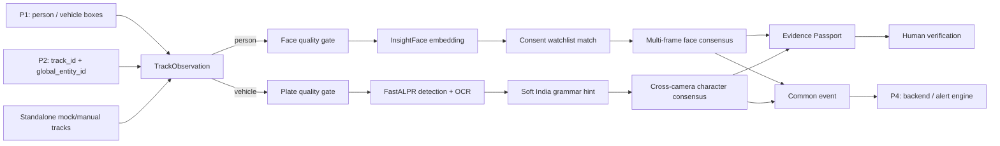

# IBVAP Person 3 — Face Recognition, ANPR, and Evidence Passport

Team handoff: read [`docs/PERSON3_IMPLEMENTATION.md`](docs/PERSON3_IMPLEMENTATION.md)
for the exact implemented scope, file map, model list, P1/P2/P4 contracts, verification
commands, limitations, and integration checklist.

P1, P2, and P4 should use
[`docs/P1_P2_P4_INTEGRATION_REQUIREMENTS.md`](docs/P1_P2_P4_INTEGRATION_REQUIREMENTS.md)
as their implementation and acceptance checklist for connecting to Person 3.

This is the complete Person 3 module from the IBVAP MVP specification. It accepts
tracked person/vehicle observations, runs face-watchlist or license-plate analysis,
rejects weak images, fuses evidence over time and cameras, and emits Person 4's
common events. It can run today without Person 1 or Person 2 by using the included
deterministic demo; later, their live tracks plug into the same `TrackObservation`.

## What is implemented

- Face detection and 512-D embedding adapter for ready-made InsightFace `buffalo_l`
- Consent/reference-aware local watchlist; no reference photographs are persisted
- Cosine matching with `UNRESOLVED`, `POSSIBLE_MATCH`, and `MATCH_CANDIDATE` states
- Face size, brightness, blur, clipping, detector-confidence, and pose gates
- Ready-made FastALPR plate detector + OCR adapter
- Raw OCR preservation plus non-destructive Indian/BH-series grammar suggestions
- Weighted multi-frame and cross-camera plate consensus
- Character-level provenance: every resolved plate character records source cameras/frames
- Alert cooldown/de-duplication
- P4-compatible common events in append-only JSONL
- Tamper-evident Evidence Passport with human `VERIFIED`/`DISMISSED` review
- Mock backends, end-to-end judge demo, unit/integration tests, and central YAML tuning

## Visual architecture



The judge wow moment is the Evidence Passport. Instead of displaying one opaque
model score, it explains which frames/cameras supported every character, shows why
bad evidence was rejected, records the face/plate decision trail, and detects JSON
tampering with SHA-256.

## Start now — no P1/P2 needed

From this directory:

```bash
python3.11 -m venv .venv
source .venv/bin/activate
python -m pip install -e '.[test]'
python scripts/demo_mock_pipeline.py
pytest
```

The demo writes:

- `demo/output/demo-summary.json`
- `demo/output/person3-events.jsonl`
- `demo/output/passports/<passport-id>.json`
- `demo/output/demo-watchlist.json`

It deliberately sends one wrong OCR reading (`MH12A81234`) across two camera
tracks. Consensus resolves `MH12AB1234`, retains the incorrect raw candidate, and
shows the supporting frames for character `B`.

## Smartphone CCTV: Motion-Gated AI Sleep Mode

PRAMAAN X can accept a smartphone RTSP/HTTP stream, perform a very cheap motion
check, and wake the Face/ANPR models only when useful visual activity is present.
It also runs a periodic safety scan while sleeping so slow movement is not trusted
to motion gating alone. This standalone demo does not require P1/P2 tracking.

Fast gate-only rehearsal using a recorded phone video:

```bash
PYTHONPATH=. .venv/bin/python scripts/demo_smartphone_ai_sleep.py /path/to/video.mp4 \
  --models none --max-frames 300
```

Live smartphone stream with the real Person 3 models:

```bash
PYTHONPATH=. .venv/bin/python scripts/demo_smartphone_ai_sleep.py \
  "http://PHONE_IP:PORT/video" --models both --display
```

The default 3% motion threshold is tuned to ignore mild smartphone compression
noise. Use `--motion-ratio 0.02` for a fixed tripod or `0.04`–`0.06` when the
phone mount vibrates. The periodic safeguard defaults to one full scan every five
seconds. The output contains an annotated MP4 and JSON report with measured
inference reduction; it does not claim unmeasured energy savings.

## Enable the ready-made models

Python 3.11 or 3.12 is recommended. The first real run downloads model weights, so
it needs network access once.

```bash
source .venv/bin/activate
python -m pip install -e '.[models,test]'
```

The configured models are ready-made; MVP training is not required:

| Function | Ready-made model | Training needed? | Adapter |
|---|---|---:|---|
| Face detection + embedding | InsightFace `buffalo_l` | No | `InsightFaceBackend` |
| Plate detection | FastALPR `yolo-v9-s-608-license-plate-end2end` | No | `FastALPRBackend` |
| Plate OCR | FastALPR `cct-s-v2-global-model` | No | `FastALPRBackend` |
| Temporal/cross-camera fusion | This repository | No | `FaceConsensus` / `PlateConsensus` |

Upstream repositories: [InsightFace](https://github.com/deepinsight/insightface) and
[FastALPR](https://github.com/ankandrew/fast-alpr).

Important: InsightFace source code and pretrained weights have different terms.
Its public pretrained model packs are generally restricted to non-commercial
research unless separately licensed. That is suitable for a hackathon prototype;
obtain the appropriate model license before commercial deployment. FastALPR and
its downloaded model artifacts must also be reviewed under their current upstream
licenses before production use. The selected versions are recorded in
`configs/model_manifest.json`.

## Enrol a demo watchlist subject

Use 3–5 clear, front-facing photos of one consenting/authorized demo subject:

```bash
python scripts/enroll_watchlist.py \
  --person-id WL-DEMO-001 \
  --name "Demo Subject" \
  --consent-reference "TEAM-CONSENT-001" \
  --images ref1.jpg ref2.jpg ref3.jpg
```

The watchlist saves normalized embeddings, not the source images. Do not use real
police/citizen watchlist data in a hackathon demo.

## P1/P2 → Person 3 contract

They call `Person3Pipeline.process()` once per tracked observation:

```python
from datetime import datetime, timezone
from ai.contracts import BoundingBox, TrackObservation

observation = TrackObservation(
    camera_id="CAM-GATE-A",
    frame_id=135,
    timestamp=datetime.now(timezone.utc),
    object_type="vehicle",              # person or vehicle
    track_id=91,                         # P2 camera-local persistent ID
    bbox=BoundingBox(40, 60, 600, 330), # P1/P2 box in the full frame
    frame=bgr_numpy_frame,
    global_entity_id="VEHICLE-007",     # optional P2 cross-camera identity
)
output = person3_pipeline.process(observation)
```

Person 3 owns all crops and models after that boundary. `global_entity_id` is
optional: without it, consensus works per local track; with it, observations from
different cameras are fused into one vehicle result. Therefore Person 3 does not
need to wait for P1/P2: develop with the mock/manual contract now and replace the
producer when their modules are ready.

## Person 3 → P4 contract

`Person3Pipeline` returns `CommonEvent` objects and can write JSONL through
`JsonlEventSink`. Event fields include:

```json
{
  "event_id": "EVT-9FBE6354A1604DB795B279F1D50C62B3",
  "event_type": "plate_detected",
  "timestamp": "2026-08-25T16:30:00Z",
  "camera_id": "CAM-GATE-A",
  "entity": {"entity_id": "VEHICLE-007", "entity_type": "vehicle"},
  "detection": {
    "class": "vehicle",
    "confidence": 0.93,
    "bbox": [40, 60, 600, 330],
    "track_id": 91
  },
  "severity": "MEDIUM",
  "metadata": {
    "producer": "person3-anpr",
    "review_status": "PENDING_HUMAN_REVIEW",
    "plate_text": "MH12AB1234",
    "evidence": {"plate_consensus": {}}
  }
}
```

The exact shared P1/P2/P3 contract is documented in
[`docs/BACKEND_EVENT_FORMAT.md`](docs/BACKEND_EVENT_FORMAT.md) and enforced by
[`configs/backend_event_schema.json`](configs/backend_event_schema.json).

P4 can replace `JsonlEventSink.publish()` with HTTP, Kafka, Redis Streams, or its
database adapter without changing face/ANPR code.

## Demo sequence for judges (90 seconds)

1. Show two camera IDs and two different local vehicle track IDs.
2. Pause on the raw OCR list and point out the deliberately incorrect frame.
3. Reveal the resolved plate and character `B` provenance from both cameras.
4. Show the face result as `MATCH_CANDIDATE`, not a final identity claim.
5. Open the Evidence Passport decision trace and integrity hash.
6. Change one value in a copied passport and show `verify_integrity()` fails.
7. Finish with human review: the system assists an operator; it does not silently convict.

## Tune and validate

All thresholds are in `configs/person3.yaml`. Tune face thresholds only on your own
validation set and camera conditions; do not copy leaderboard thresholds blindly.
For the hackathon, report:

- face false-match and false-non-match counts at the chosen threshold;
- plate full-string exact accuracy and character accuracy;
- percentage of frames rejected by quality gates;
- median/p95 latency on the actual demo laptop;
- single-frame OCR versus multi-frame/cross-camera exact accuracy.

Run checks:

```bash
PYTHONPATH=. python -m compileall -q ai scripts
pytest
python scripts/demo_mock_pipeline.py
```

## Repository map

```text
ai/contracts.py              stable P1/P2/P4 dataclasses
ai/pipeline.py               top-level Person 3 orchestrator
ai/face/                     InsightFace, watchlist, quality, consensus
ai/anpr/                     FastALPR, format hints, quality, consensus
ai/evidence/                 common events and Evidence Passport
ai/mocks.py                  deterministic no-download demo backends
configs/person3.yaml         all runtime thresholds/models
configs/model_manifest.json  ready-made model and licensing record
scripts/                     demo and watchlist enrollment
tests/                       unit and integration coverage
```

## Safety defaults

- A face output is a `MATCH_CANDIDATE` pending human review, not proven identity.
- Ambiguous top-two face matches reveal no person name.
- Low-quality images cannot trigger a confirmed event.
- Raw OCR is retained; grammar suggestions never silently overwrite evidence.
- Alerts are de-duplicated during cooldown.
- Watchlist enrollment requires a non-empty consent/authority reference.
- Evidence Passport records are integrity-checked and reviewed explicitly.
